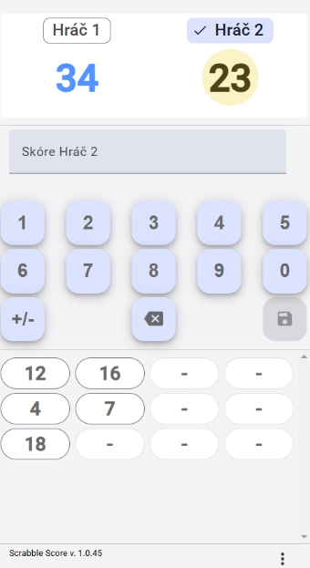

# ScrabbleScore
Score Counter for Scrabble
Aplikácia s sčítavanie skóre v scrabble - v mobile, namiesto papiera  a excelu
Vlastnosti
- zmena poradia hráčov (drag/drop)
- výber počtu hráčov
- premenovanie hráča
- editácia zadaného skóre
- interná klávesnica
- zadanie záporného počtu bodov
- log skóre
- PWA aplikácia s možnosťou inštalácie na plochu
- [voľne dostupné](https://b-mi.github.io/ScrabbleScore/)
- Licencia MIT

